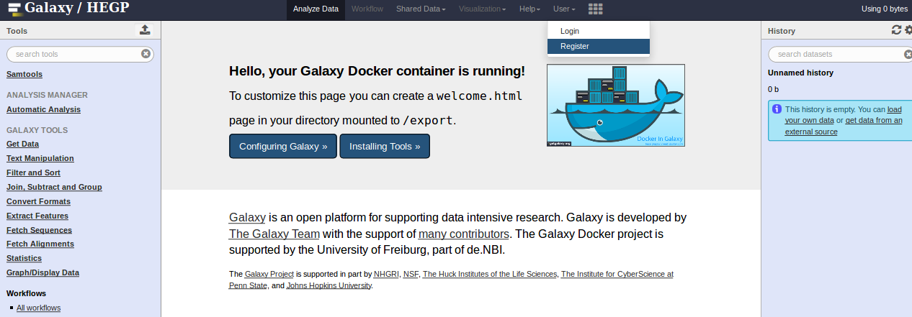
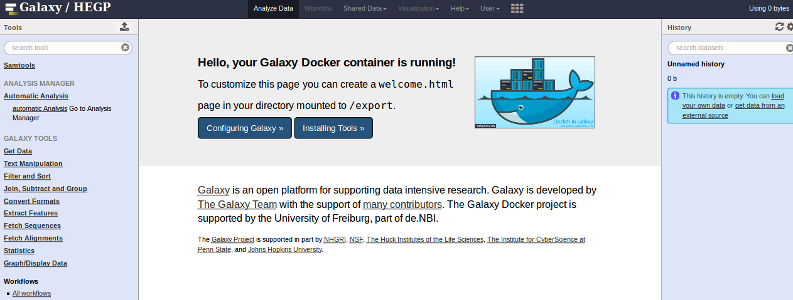
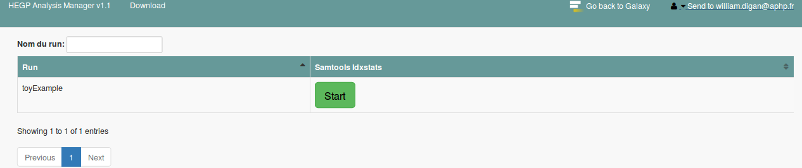
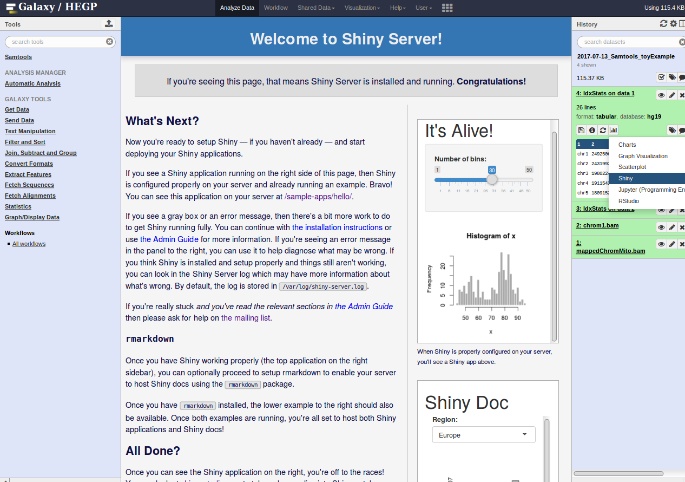

# GalaxyDockerPublic
--------------------


This docker image was based on the [bgruening/docker-galaxy-stable:16.04](https://github.com/bgruening/docker-galaxy-stable)
and was developed for HEGP. This project is based on docker-compose and on the
docker in docker deployment facility. 
This project used 7 docker containers :
- Galaxy : A web interface for NGS analysis
- DataManager/analysisManager a web interface to faciliate an automatize NGS analysis
- Database (Postgre) which contains the analysis manager database
- Regate : to generate EDAM ontology
- Redis server : use by the analysis manager to generate cron job
- DockerTools2Galaxy: to generate galaxy xml file from a docker image.
 

The following instructions will describe you what are the prerequisites,
 how to install the project and how to run it.

## 1.A :  Requirements
--------------------

- Ubuntu 14.04
- Kernel 3.13.0-79-generic (if not changed. Processes could generated 
  java defunc/Java zombie process)
- [Docker version 1.12](https://www.docker.io/gettingstarted/#h_installation)
- Docker-compose version 1.12
This work was performed on a Linux server 
with 4 core and 30giga of ram for development
and 20 cores and 50 giga of ram for production


## 1.B Port Explaination
--------------------

-          8123:80   -  Galaxy Web app
-          9010:8000 - Analysismanager
-          5005:5000 - local registry connection (not connected)
-          8021:21   - transfert data  to galaxy via FTP protocol 
-          8800:8800 - handle Galaxy Interactive Environments
-          6379:6379 - Redis server
-          5432:5432 - Postgre Database

## 1.C : Installation
--------------------

* All configuration files are located on the folder config. 
Start to edit the file **config/configDataManager/GlobalVariables.py**
and define all the main variables such as *http_proxy* and the *serverName*
* Go to the folder bin. It contains all the templates file Generator to 
automatize and faciliate as much as possible the Analysis Manager Deployment.

```sh
cd bin
```
* Run the following scripts

```sh
#to clean all configuration files 
sudo sh cleanAlldata.sh
#This script will build the image of two samtools galaxy tools and build the 
#tool.xml file associated 
sudo sh 0_generatestoolconfig.sh
#This script will build the generate the configuration file needed to Galaxy 
#and the Analysis Manager
sudo bash 1_GenerateConfiguration.sh
```
*  Go back to the main folder with the command and build the project with 
docker-compose. It will take a certain time.

```sh
cd ..
docker-compose build
```

* Before you start Galaxy, be sure that all the port are open cf (FAQ 4.2).
and run them  all the containers with docker-compose.

```sh
#Start all the containers
docker-compose up -d
#To see the logs run
docker-compose logs -f
#if a new build is performed to clean tmp files generated go to bin and run
cd bin
sudo sh cleanTmpdata.sh
```

## 2 : Tutorial
--------------------

#### 2.1 : Build a galaxy xml with dockertools2galaxy


(a) Download the image biocontainers/samtools:1.3.1 with 

```sh
docker pull biocontainers/samtools:1.3.1
```

(b) Go to the folder images/inspectTest and look at the Dockerfile.
We define some variables in order to directly generates the xml tool for
Galaxy from define environment Variable inside the Docherfile. Follow the 
instruction in the README.md file of dockertools2galaxy.
To go further, we build the image and save the configuration to a file with the
following command.

```sh
cd images/inspectTest
sh build_image.sh
docker inspect samtools_idxstats
```

(c) In the folder dockertool2galaxy the python script will take as 
input the inspect.out and build a tool.xml file. Run the following command to perform 
this operation.

```sh
cd dockertools2galaxy/
python dockertools2galaxy.py -i ../images/inspectTest/inspect_samtools_idxstats.txt -o ../tools/samtools_docker/samtools_idxstats/samtools_idxstats.xml
python dockertools2galaxy.py -i ../images/multiInput/inspect_samtools_bedcov.txt -o ../tools/samtools_docker/samtools_bedcov/samtools_bedcov.xml
```

#### 2.2 : Start Galaxy and the use the Analysis manager.

(a) Follow the Installation section to know how to run Galaxy and the Analysis
manager. When the Galaxy Instance is ready, Register a new  Galaxy user in the login section



(b) To access the Analysis Manager in the tool panel performed a left click on the link
*Automatic Analysis*. You will be send to the Analysis Manager interface. 
*(It take 5 minutes more for the Analysis Manager to be ready.)*



(c) In the *Home page* you can directly run example. Just click on the start buttton.
In the *Downloads page*, you can update the number and backup a specific run.
Our work is able to connect to an Ion Torrent sequencer.



#### 2.3 : How to use a Shiny environnemt

(a) You need to be log in Galaxy.
(b) Load a tabulate file and it will be available 
(c) Make a left click on the *Vizualize" Button and select Shiny. *(The
first time it will appear after 2 min the download of the docker image takes some times)*


#### 2.4 : the sql command to obtain the same table

PGPASSWORD=postgres psql  -h "yourservername" -p 5434 -d "analysismanager" -U "postgres"

```sql
-- first command
select  job_create_time, job_user_email_id,job_tool_id_id,job_params,job_inputs
from sequencer_usercommonjobs;
-- second command
SELECT *
FROM sequencer_workflowstools_inputlist as inpp, sequencer_supportedfiles as supp
WHERE inpp.supportedfiles_id = supp.id;
```

 id |                  workflowstools_id                  | supportedfiles_id | id | dataHandle |     dataDescription     |       dataFormatEdamOntology       
----|-----------------------------------------------------|-------------------|----|------------|-------------------------|-------------------------------------

the table of the genome was obtain by parsing the file hegpGenomes.loc
which contains our reference genome. it is the only file present on the tool_data_table_conf.xml.sample

## 3 : License
--------------------

This project is licensed under the MIT License
 
The MIT License (MIT)
Copyright (c) <2017> <APHP-HEGP>
Permission is hereby granted, free of charge, to any person obtaining a copy of 
this software and associated documentation files (the "Software"), to deal in 
the Software without restriction, including without limitation the rights to use,
copy, modify, merge, publish, distribute, sublicense, and/or sell copies of the
Software, and to permit persons to whom the Software is furnished to do so, 
subject to the following conditions:
The above copyright notice and this permission notice shall be included in all 
copies or substantial portions of the Software.
THE SOFTWARE IS PROVIDED "AS IS", WITHOUT WARRANTY OF ANY KIND, EXPRESS OR IMPLIED,
INCLUDING BUT NOT LIMITED TO THE WARRANTIES OF MERCHANTABILITY, FITNESS FOR A 
PARTICULAR PURPOSE AND NONINFRINGEMENT. IN NO EVENT SHALL THE AUTHORS OR COPYRIGHT
HOLDERS BE LIABLE FOR ANY CLAIM, DAMAGES OR OTHER LIABILITY, WHETHER IN AN ACTION
OF CONTRACT, TORT OR OTHERWISE, ARISING FROM, OUT OF OR IN CONNECTION WITH THE 
SOFTWARE OR THE USE OR OTHER DEALINGS IN THE SOFTWARE.
 


## 4 : FAQ
--------------------

#### 4.1 : Go inside the container

```sh
docker exec -it galaxy_hegp bash 
```

#### 4.2 : Check port status if problem

Ubuntu 14.04 check port states
```sh
ufw status
```

Open Galaxy ports

```sh
sudo ufw allow 8021 
sudo ufw allow 8800
sudo ufw allow 8123
```

Do the same for all the following ports
#9000 5005 6379 5434 1026 25 9011

#### 4.3 : Download a specific kernel version

```sh
#https://github.com/docker/docker/issues/18180
#due to generation of zombie process need to change the java kernel 
sudo apt-get update
sudo apt-get install software-properties-common -y
#sudo add-apt-repository ppa:chiluk/1533043
sudo apt-get update
sudo apt-get install linux-image-3.13.0-79-generic \
sudo apt-get linux-image-extra-3.13.0-79-generic -y
```


#### 4.4 : Set “older” kernel as default grub entry from StakeOveflow

```sh
#https://github.com/docker/docker/issues/18180
#due to generation of zombie process need to change the java kernel 
sudo cp /etc/default/grub /etc/default/grub.bak
```

Then edit the file using the text editor of your choice (ie. gedit, etc.).

```sh
sudo gedit /etc/default/grub
###examples:
##kernel 4.2.2 --> 0
#GRUB_DEFAULT="0"
##Kernel 3.13.0.79 --> 1>2 (the one you want)
GRUB_DEFAULT="1>2"
```

Finally update the Grub. and reboot your machine

```sh
sudo update-grub
sudo reboot
``` 
